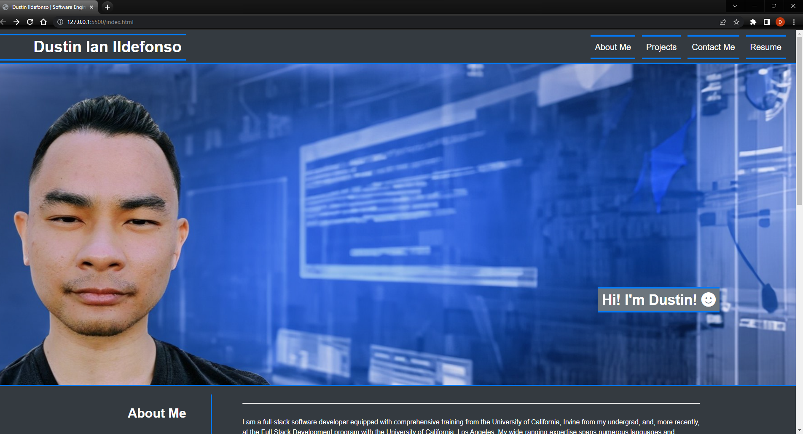

# Portfolio of Dustin Ildefonso, Software Engineer

This repository hosts the code for the personal portfolio of Dustin Ildefonso (me), a full-stack software engineer. The portfolio showcases my skills, experience, and past projects.

## Table of Contents

- [Introduction](#introduction)
- [Technologies](#technologies)
- [Setup](#setup)
- [Deployed Application](#deployed-application)
- [Pages](#pages)
- [Screenshot](#screenshot)
- [Contact](#contact)

## Introduction

The purpose of this portfolio is to provide an overview of my capabilities as a programmer, through showcasing some of the projects I was involved in. The portfolio has sections about my background, projects, contact information, and my resume.

## Technologies

The project was developed using:

- HTML5
- CSS3
- Font Awesome

## Setup

To view the portfolio, you can visit the deployed application. If you wish to inspect the code:
1. Clone the repository to your local machine.
```markdown
git clone https://github.com/dustinii/PortfolioV1.git
```
2. Open the `index.html` in your preferred browser.

## Deployed Application
The live application can be viewed [here]().

## Pages

The website has the following sections:

1. **About Me**: This section provides a brief overview of my background, skills, and experience.
2. **Projects**: This section showcases my projects. Each project has a link to the live application.
3. **Contact Me**: This section provides various methods to reach out to me, including my phone number, email, GitHub profile, and LinkedIn profile.
4. **Resume**: This section contains a link to my resume.

## Screenshot



## Contact

If you have any questions or would like to discuss opportunities to collaborate, please reach out via the contact methods provided in the "Contact Me" section of the portfolio.

